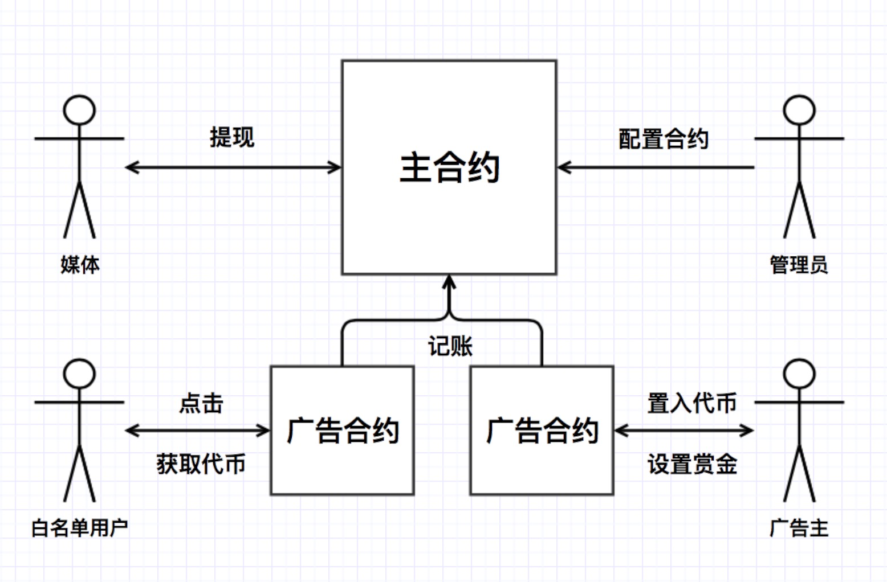
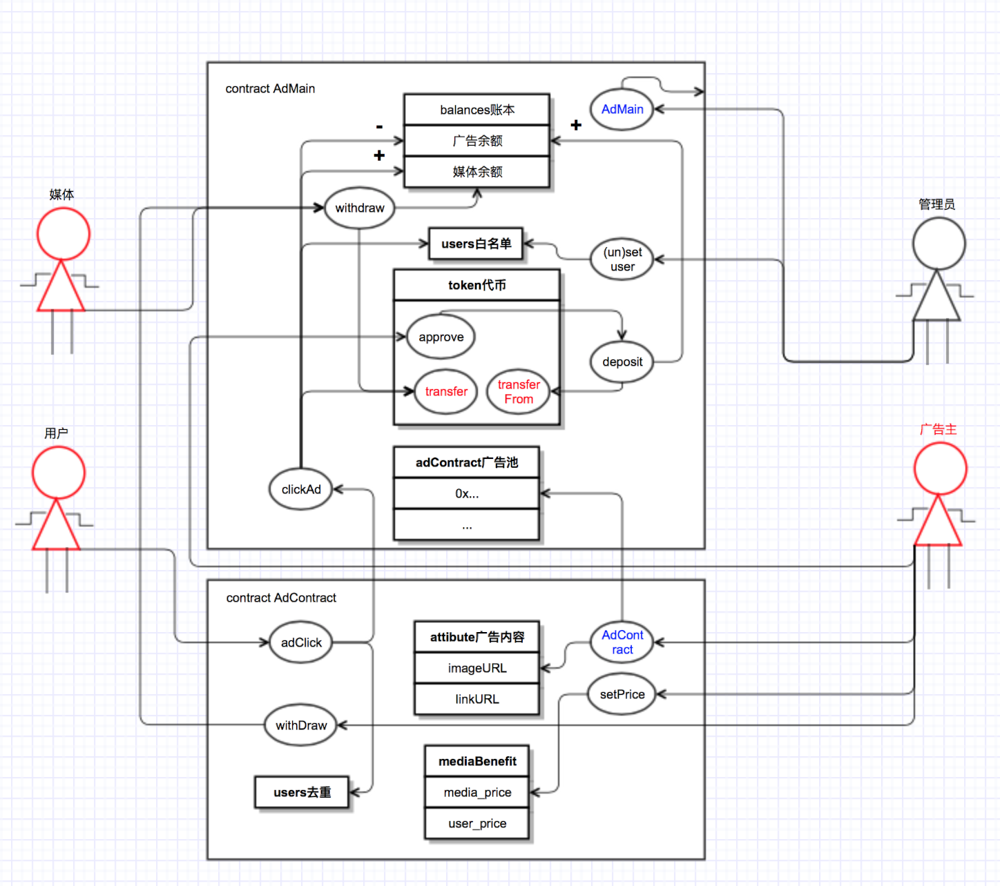
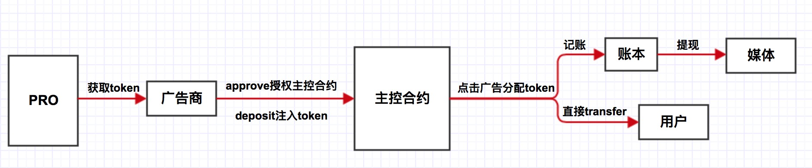

# Advertisement Putting
基于以太坊的积分墙Dapp设计

搭建一个基于以太坊区块链的积分墙Dapp，广告商定制广告合约并注入Token奖励，白名单内的用户通过点击广告获取Token奖励，媒体方在用户点击中亦可获得Token提成.

###利用去中心化区块链技术为中小网站/个人博客/开源项目创造用户良好的流量变现方式

###一、基本框架
1. 合约分工：
  - 主控合约：实现广告商、媒体、用户之间Token奖励的交易与数据记录
  - 广告合约：广告商为每个广告定制专属的链上合约，配置Token奖励的分配方式
2. 客户操作：
  - 广告商：创建广告合约、注入Token
  - 白名单用户：点击广告、获取代币
  - 媒体方：展示广告、获得Token分成
  - 管理员：创建主控合约、配置白名单

###二、技术实现

####技术栈
   - 后端
     - 使用Solidity语言基于remix开发以太坊智能合约；
     - 利用truffle框架进行编译、部署和测试；
     - 在testrpc, Ropsten, Rinkeby上进行ERC20代币发布和合约部署，并进行充分测试。
   - 前端
     - 使用ant, react开发框架，实现响应式布局、滑动式广告播放等特效；
     - 利用nodejs/web3与后端/智能合约进行交

###三、交互流程

###四、合约框架

### 五、Token流向

### 四、优化

1.合约逻辑优化
  -链下结算节约交易成本
    - 每次点击，不直接发起链上交易，广告商提供签名，周期结算Token，媒体方和用户可随时利用签名提取Token

2.反作弊机制
  - 签名验证：广告商提供一次性签名，在合约中验证签名，提过攻击者成本，避免用户绕过广告直接获取Token
  - 签名聚合：将多个签名聚合成一个签名，一次验证(BLS算法)

3.形式化验证
  - 方法概述
    - 利用Promela语言对合约进行重写，通过数据结构约简优化state vector的大小；同时用SPIN对模型进行仿真和验证，即可得到最终验证结果
  - 属性描述
    - 我们使用LTL(线性时态逻辑)对系统的Safety/Liveness属性进行描述
      - 用户点击广告后，在满足各项条件时，最终余额总会增加广告中所要奖励的Token数
      - 用户重复点击同一广告不会被“双重支付”
      - ...

###五、Demo展示

* 本地安装node.js，配置[truffle]环境(http://truffleframework.com/docs/getting_started/installation)

*拷贝本项目：git clone https://github.com/chansonyhu/ad_putting.git

*编译：truffle compile

*运行：npm start

*需要安装[MetaMask]以太坊轻钱包(https://metamask.io)

### 六、团队成员

- 合约开发：李辰星、曾丽仪、于千山
- 前端开发：谭旭、侯佳莹、夏提克

